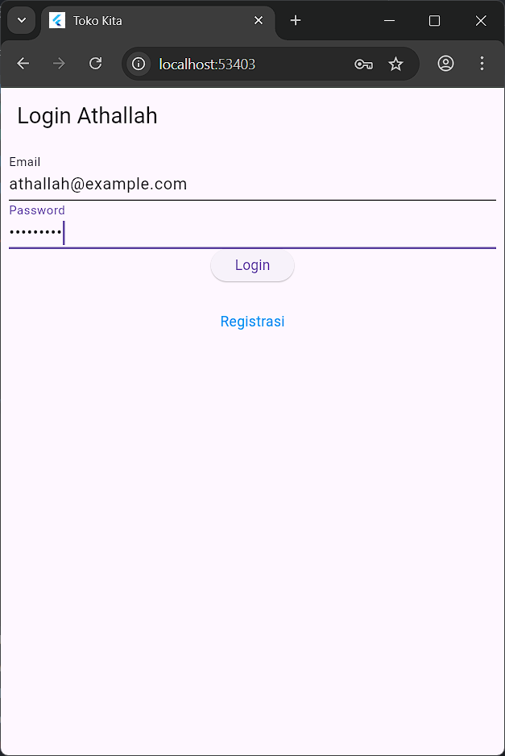
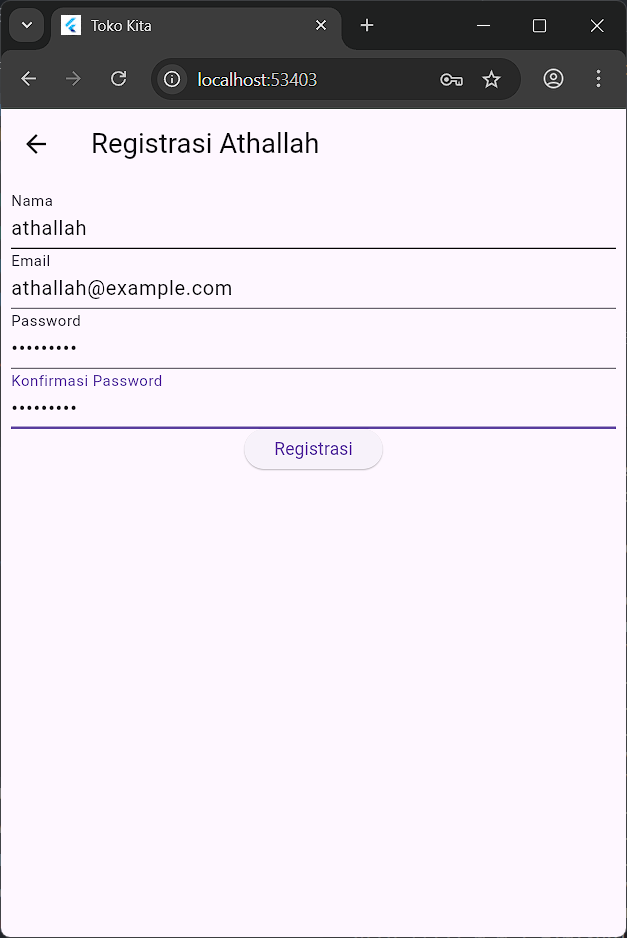
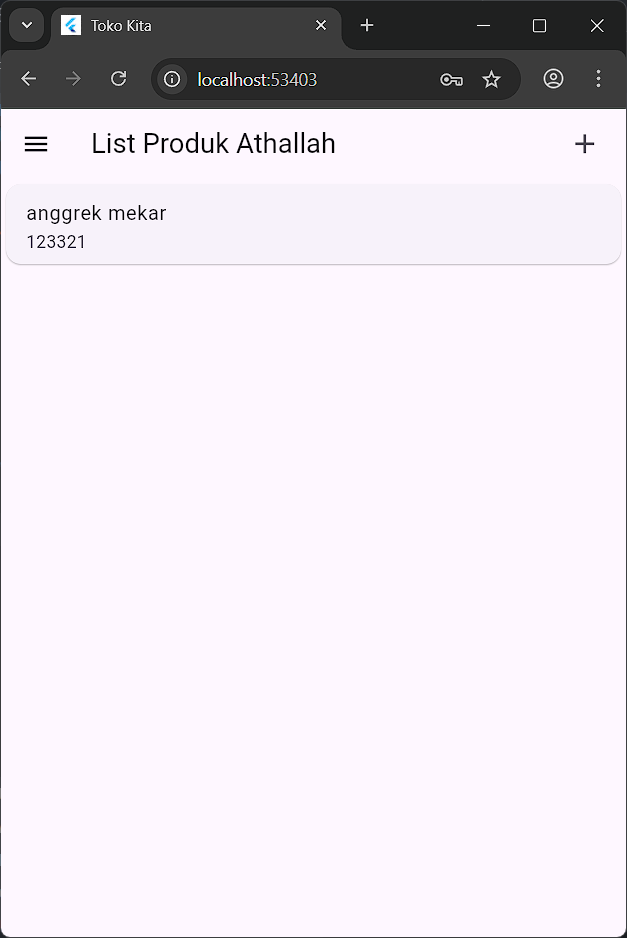
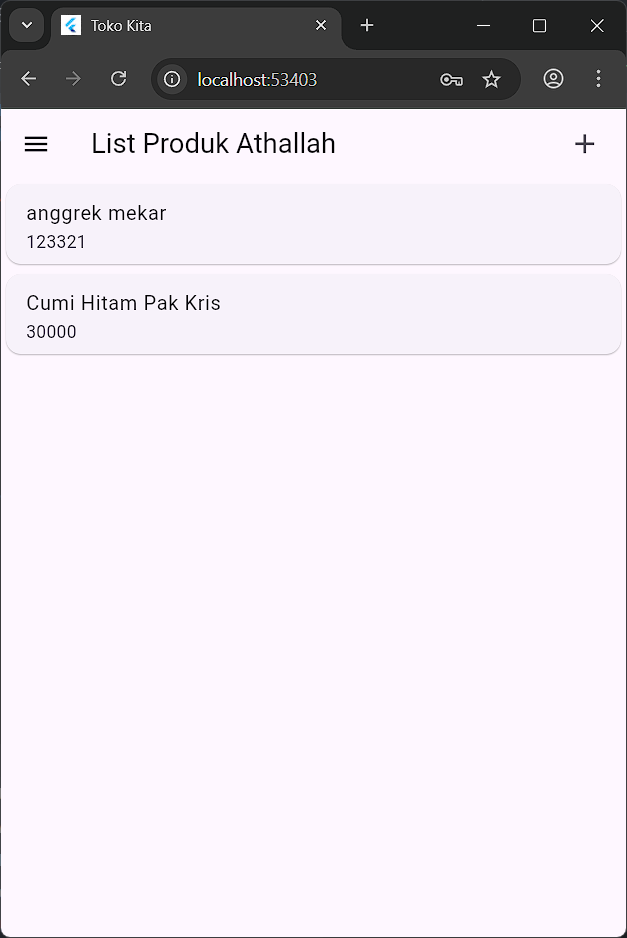
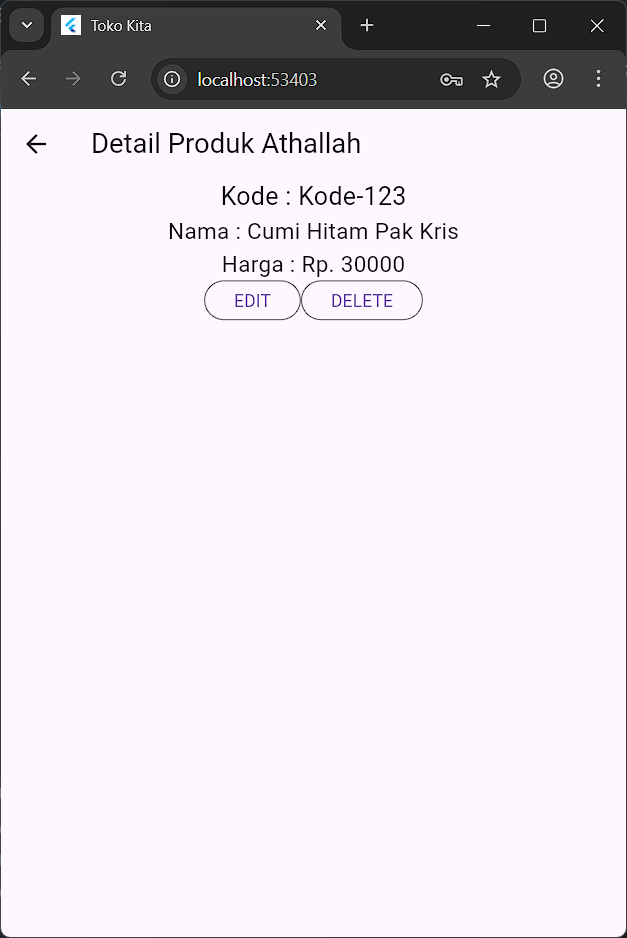
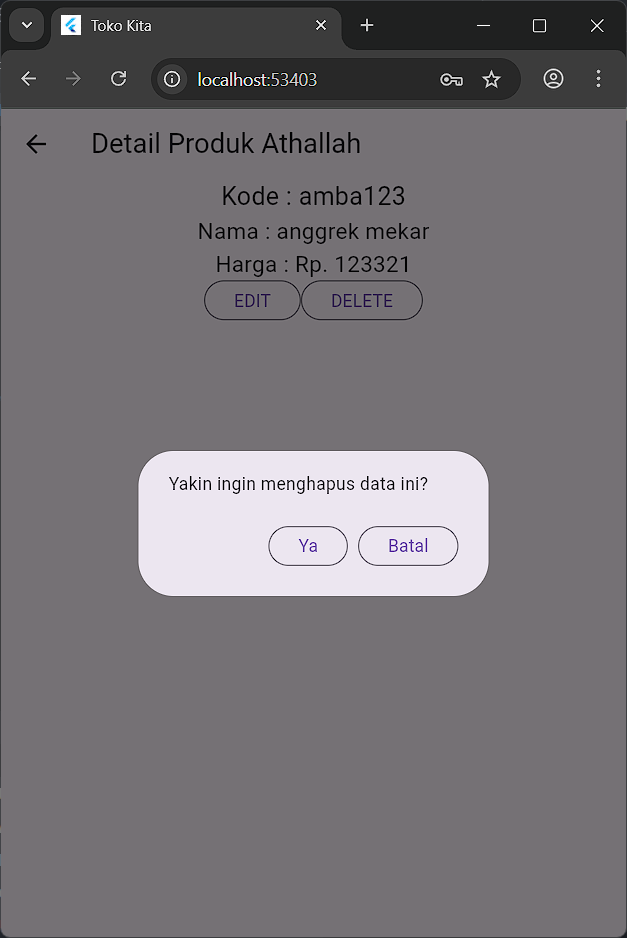
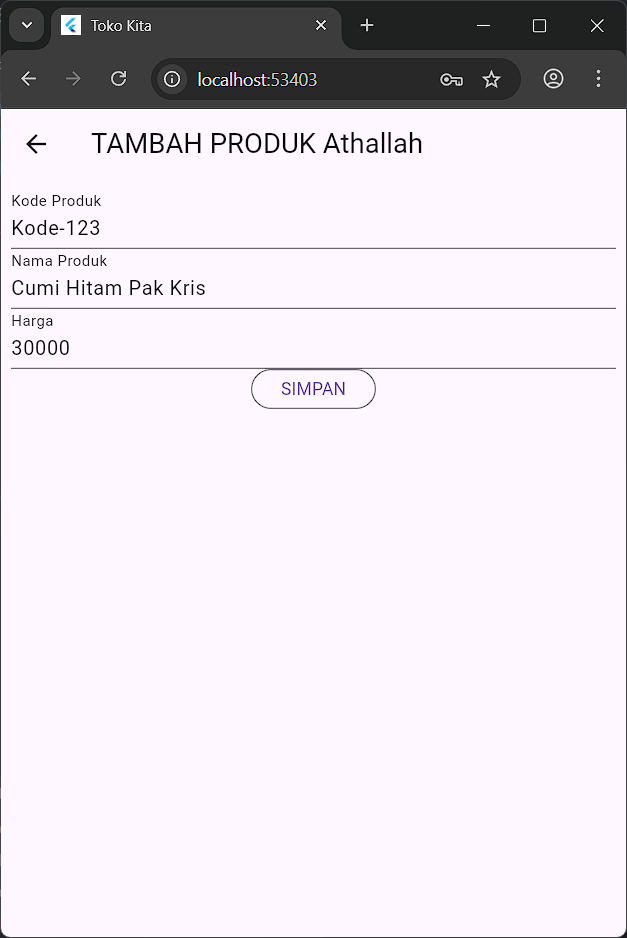
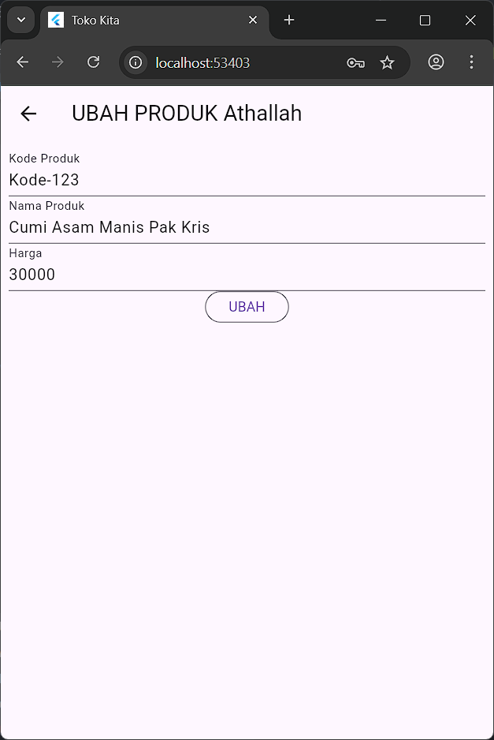

# Toko Kita - Aplikasi Flutter dengan API Integration

Aplikasi manajemen produk yang dibuat menggunakan Flutter dengan integrasi backend API. Aplikasi ini memiliki fitur otentikasi (login/registrasi) dan CRUD (Create, Read, Update, Delete) produk yang terhubung langsung dengan REST API backend.

**Nama: Athallah**

---

## Arsitektur Aplikasi

Aplikasi ini menggunakan arsitektur **BLoC Pattern** dengan **HTTP API Integration** untuk komunikasi dengan backend server. Semua data disimpan dan dikelola melalui API calls.

### Struktur API:
- **Base URL**: `http://10.206.239.12:8080`
- **Authentication**: Bearer Token
- **Storage**: SharedPreferences untuk token management

---

## Daftar Halaman

1. [Halaman Login](#1-halaman-login)
2. [Halaman Registrasi](#2-halaman-registrasi)
3. [Halaman List Produk](#3-halaman-list-produk)
4. [Halaman Detail Produk](#4-halaman-detail-produk)
5. [Halaman Form Produk (Tambah/Ubah)](#5-halaman-form-produk-tambahubah)
6. [API Layer & BLoC Pattern](#6-api-layer--bloc-pattern)

---

## 1. Halaman Login



### Penjelasan Kode

**File: `lib/ui/login_page.dart`**

Halaman login kini terintegrasi dengan API backend untuk autentikasi user.

#### Komponen Utama:

**1. Form Controller:**
```dart
final _formKey = GlobalKey<FormState>();
final _emailTextboxController = TextEditingController();
final _passwordTextboxController = TextEditingController();
bool _isLoading = false;
```
- `_isLoading`: Loading state untuk menampilkan indikator loading

**2. Proses Login dengan API:**
```dart
void _submit() {
  _formKey.currentState!.save();
  setState(() {
    _isLoading = true;
  });
  LoginBloc.login(
    email: _emailTextboxController.text, 
    password: _passwordTextboxController.text
  ).then((value) async {
    if (value.code == 200) {
      await UserInfo().setToken(value.token.toString());
      await UserInfo().setUserID(int.parse(value.userID.toString()));
      Navigator.pushReplacement(context,
        MaterialPageRoute(builder: (context) => const ProdukPage()));
    } else {
      showDialog(
        context: context,
        builder: (BuildContext context) => const WarningDialog(
          description: "Login gagal, silahkan coba lagi",
        ));
    }
  }, onError: (error) {
    showDialog(
      context: context,
      builder: (BuildContext context) => const WarningDialog(
        description: "Login gagal, silahkan coba lagi",
      ));
  });
  setState(() {
    _isLoading = false;
  });
}
```

**Key Features:**
- **API Integration**: Menggunakan `LoginBloc.login()` untuk komunikasi dengan backend
- **Token Management**: Menyimpan token dan user ID di SharedPreferences
- **Error Handling**: Menampilkan dialog error jika login gagal
- **Loading State**: Indikator loading selama proses autentikasi
- **Navigation**: Redirect otomatis ke halaman produk setelah login berhasil

**3. Loading Indicator:**
```dart
Widget _buttonLogin() {
  return ElevatedButton(
    child: _isLoading 
      ? const CircularProgressIndicator(color: Colors.white)
      : const Text("Login"),
    onPressed: _isLoading ? null : () {
      var validate = _formKey.currentState!.validate();
      if (validate) {
        _submit();
      }
    }
  );
}
```

---

## 2. Halaman Registrasi



### Penjelasan Kode

**File: `lib/ui/registrasi_page.dart`**

Halaman registrasi terintegrasi dengan API untuk membuat akun user baru.

#### Komponen Utama:

**1. Form Controllers & State:**
```dart
final _formKey = GlobalKey<FormState>();
final _namaTextboxController = TextEditingController();
final _emailTextboxController = TextEditingController();
final _passwordTextboxController = TextEditingController();
final _konfirmasiPasswordTextboxController = TextEditingController();
bool _isLoading = false;
```

**2. Proses Registrasi dengan API:**
```dart
void _submit() {
  _formKey.currentState!.save();
  setState(() {
    _isLoading = true;
  });
  RegistrasiBloc.registrasi(
    nama: _namaTextboxController.text,
    email: _emailTextboxController.text,
    password: _passwordTextboxController.text
  ).then((value) {
    showDialog(
      context: context,
      barrierDismissible: false,
      builder: (BuildContext context) => SuccessDialog(
        description: "Registrasi berhasil, silahkan login",
        okClick: () {
          Navigator.pop(context);
        },
      ));
  }, onError: (error) {
    showDialog(
      context: context,
      barrierDismissible: false,
      builder: (BuildContext context) => const WarningDialog(
        description: "Registrasi gagal, silahkan coba lagi",
      ));
  });
  setState(() {
    _isLoading = false;
  });
}
```

**Key Features:**
- **API Integration**: Menggunakan `RegistrasiBloc.registrasi()` untuk komunikasi dengan backend
- **Success/Error Feedback**: Custom dialog untuk menampilkan hasil registrasi
- **Loading State**: Indikator loading selama proses registrasi
- **Navigation**: Kembali ke halaman login setelah registrasi berhasil

**3. Enhanced Password Validation:**
```dart
Widget _passwordKonfirmasiTextField() {
  return TextFormField(
    decoration: const InputDecoration(labelText: "Konfirmasi Password"),
    obscureText: true,
    controller: _konfirmasiPasswordTextboxController,
    validator: (value) {
      if (value != _passwordTextboxController.text) {
        return "Konfirmasi Password tidak sama";
      }
      return null;
    },
  );
}
```

---

## 3. Halaman List Produk




### Penjelasan Kode

**File: `lib/ui/produk_page.dart`**

Halaman ini menampilkan daftar produk yang diambil secara real-time dari API backend.

#### Komponen Utama:

**1. State Management & Data Fetching:**
```dart
class _ProdukPageState extends State<ProdukPage> {
  @override
  Widget build(BuildContext context) {
    return Scaffold(
      appBar: AppBar(
        title: const Text('List Produk Athallah'),
        actions: [
          Padding(
            padding: const EdgeInsets.only(right: 20.0),
            child: GestureDetector(
              child: const Icon(Icons.add, size: 26.0),
              onTap: () async {
                Navigator.push(context,
                  MaterialPageRoute(builder: (context) => ProdukForm()));
              },
            )
          )
        ],
      ),
      drawer: Drawer(
        child: ListView(
          children: [
            ListTile(
              title: const Text('Logout'),
              trailing: const Icon(Icons.logout),
              onTap: () async {
                await LogoutBloc.logout().then((value) => {
                  Navigator.of(context).pushAndRemoveUntil(
                    MaterialPageRoute(builder: (context) => const LoginPage()),
                    (route) => false)
                });
              },
            )
          ],
        ),
      ),
      body: FutureBuilder<List>(
        future: ProdukBloc.getProduks(),
        builder: (context, snapshot) {
          if (snapshot.hasError) print(snapshot.error);
          return snapshot.hasData
            ? ListProduk(list: snapshot.data)
            : const Center(child: CircularProgressIndicator());
        },
      ),
    );
  }
}
```

**Key Features:**
- **FutureBuilder**: Untuk handling async data loading dari API
- **Loading State**: CircularProgressIndicator selama data loading
- **Error Handling**: Print error jika terjadi masalah API call
- **Logout Integration**: Menggunakan LogoutBloc untuk clear token

**2. Widget ListProduk untuk Menampilkan Data:**
```dart
class ListProduk extends StatelessWidget {
  final List? list;
  const ListProduk({Key? key, this.list}) : super(key: key);

  @override
  Widget build(BuildContext context) {
    return ListView.builder(
      itemCount: list == null ? 0 : list!.length,
      itemBuilder: (context, i) {
        return ItemProduk(
          produk: list![i],
        );
      },
    );
  }
}
```

**3. Real-time Data Update:**
```dart
class ItemProduk extends StatelessWidget {
  final Produk produk;
  const ItemProduk({Key? key, required this.produk}) : super(key: key);

  @override
  Widget build(BuildContext context) {
    return GestureDetector(
      onTap: () {
        Navigator.push(
          context,
          MaterialPageRoute(
            builder: (context) => ProdukDetail(produk: produk)
          )
        );
      },
      child: Card(
        child: ListTile(
          title: Text(produk.namaProduk!),
          subtitle: Text(produk.hargaProduk.toString()),
        ),
      ),
    );
  }
}
```

**API Integration:**
- Data produk diambil dari endpoint `/produk` menggunakan `ProdukBloc.getProduks()`
- Automatic refresh setiap kali halaman dibuka
- Data real-time dari database backend

---

## 4. Halaman Detail Produk




### Penjelasan Kode

**File: `lib/ui/produk_detail.dart`**

Halaman ini menampilkan detail produk dengan operasi delete yang terintegrasi dengan API.

#### Komponen Utama:

**1. Menerima Data Produk:**
```dart
class ProdukDetail extends StatefulWidget {
  Produk? produk;
  ProdukDetail({Key? key, this.produk}) : super(key: key);
  
  @override
  _ProdukDetailState createState() => _ProdukDetailState();
}
```

**2. Menampilkan Detail dengan Loading State:**
```dart
body: Center(
  child: Column(
    children: [
      Text(
        "Kode : ${widget.produk!.kodeProduk}",
        style: const TextStyle(fontSize: 20.0),
      ),
      Text(
        "Nama : ${widget.produk!.namaProduk}",
        style: const TextStyle(fontSize: 18.0),
      ),
      Text(
        "Harga : Rp. ${NumberFormat.currency(locale: 'id', symbol: 'Rp ', decimalDigits: 0).format(widget.produk!.hargaProduk)}",
        style: const TextStyle(fontSize: 18.0),
      ),
      _tombolHapusEdit()
    ],
  ),
),
```

**3. API Integration untuk Delete:**
```dart
void confirmHapus() {
  AlertDialog alertDialog = AlertDialog(
    content: const Text("Yakin ingin menghapus data ini?"),
    actions: [
      OutlinedButton(
        child: const Text("Ya"),
        onPressed: () {
          ProdukBloc.deleteProduk(id: int.parse(widget.produk!.id!)).then(
            (value) => {
              Navigator.of(context).push(MaterialPageRoute(
                builder: (context) => const ProdukPage()))
            }, onError: (error) {
              showDialog(
                context: context,
                builder: (BuildContext context) => const WarningDialog(
                  description: "Hapus gagal, silahkan coba lagi",
                ));
            });
        },
      ),
      OutlinedButton(
        child: const Text("Batal"),
        onPressed: () => Navigator.pop(context),
      )
    ],
  );
  showDialog(builder: (context) => alertDialog, context: context);
}
```

**Key Features:**
- **API Delete**: Menggunakan `ProdukBloc.deleteProduk()` untuk menghapus dari backend
- **Confirmation Dialog**: Dialog konfirmasi sebelum delete
- **Error Handling**: Menampilkan warning dialog jika delete gagal
- **Navigation**: Redirect ke list produk setelah delete berhasil
- **Currency Formatting**: Format rupiah untuk tampilan harga

**4. Tombol Edit dengan Navigation:**
```dart
Widget _tombolHapusEdit() {
  return Row(
    mainAxisSize: MainAxisSize.min,
    children: [
      OutlinedButton(
        child: const Text("EDIT"),
        onPressed: () {
          Navigator.push(
            context,
            MaterialPageRoute(
              builder: (context) => ProdukForm(produk: widget.produk!),
            ),
          );
        },
      ),
      OutlinedButton(
        child: const Text("DELETE"),
        onPressed: () => confirmHapus(),
      ),
    ],
  );
}
```

---

## 5. Halaman Form Produk (Tambah/Ubah)




### Penjelasan Kode

**File: `lib/ui/produk_form.dart`**

Form ini mendukung operasi CREATE dan UPDATE produk dengan integrasi API penuh.

#### Komponen Utama:

**1. State Variables & Mode Detection:**
```dart
class _ProdukFormState extends State<ProdukForm> {
  final _formKey = GlobalKey<FormState>();
  bool _isLoading = false;
  String judul = "TAMBAH PRODUK ATHALLAH";
  String tombolSubmit = "SIMPAN";
  
  final _kodeProdukTextboxController = TextEditingController();
  final _namaProdukTextboxController = TextEditingController();
  final _hargaProdukTextboxController = TextEditingController();
}
```

**2. API Integration untuk CREATE:**
```dart
simpan() {
  setState(() {
    _isLoading = true;
  });
  Produk createProduk = Produk(id: null);
  createProduk.kodeProduk = _kodeProdukTextboxController.text;
  createProduk.namaProduk = _namaProdukTextboxController.text;
  createProduk.hargaProduk = int.parse(_hargaProdukTextboxController.text);
  
  ProdukBloc.addProduk(produk: createProduk).then((value) {
    Navigator.of(context).push(MaterialPageRoute(
      builder: (BuildContext context) => const ProdukPage()));
  }, onError: (error) {
    showDialog(
      context: context,
      builder: (BuildContext context) => const WarningDialog(
        description: "Simpan gagal, silahkan coba lagi",
      ));
  });
  setState(() {
    _isLoading = false;
  });
}
```

**3. API Integration untuk UPDATE:**
```dart
ubah() {
  setState(() {
    _isLoading = true;
  });
  Produk updateProduk = Produk(id: widget.produk!.id!);
  updateProduk.kodeProduk = _kodeProdukTextboxController.text;
  updateProduk.namaProduk = _namaProdukTextboxController.text;
  updateProduk.hargaProduk = int.parse(_hargaProdukTextboxController.text);
  
  ProdukBloc.updateProduk(produk: updateProduk).then((value) {
    Navigator.of(context).push(MaterialPageRoute(
      builder: (BuildContext context) => const ProdukPage()));
  }, onError: (error) {
    showDialog(
      context: context,
      builder: (BuildContext context) => const WarningDialog(
        description: "Permintaan ubah data gagal, silahkan coba lagi",
      ));
  });
  setState(() {
    _isLoading = false;
  });
}
```

**Key Features:**
- **Dual Mode**: Satu form untuk CREATE dan UPDATE
- **Auto-populate**: Data existing terisi otomatis untuk mode edit
- **API Integration**: Menggunakan `ProdukBloc.addProduk()` dan `ProdukBloc.updateProduk()`
- **Loading States**: Indikator loading selama API calls
- **Error Handling**: Dialog warning untuk error feedback
- **Data Validation**: Validasi input sebelum submit
- **Navigation**: Redirect ke list produk setelah operasi berhasil

**4. Submit Handler dengan Mode Detection:**
```dart
Widget _buttonSubmit() {
  return OutlinedButton(
    child: _isLoading
      ? const SizedBox(
          width: 20,
          height: 20, 
          child: CircularProgressIndicator(strokeWidth: 2)
        )
      : Text(tombolSubmit),
    onPressed: _isLoading ? null : () {
      var validate = _formKey.currentState!.validate();
      if (validate) {
        if (!_isLoading) {
          if (widget.produk != null) {
            ubah(); // Mode UPDATE
          } else {
            simpan(); // Mode CREATE
          }
        }
      }
    }
  );
}
```

---

## 6. API Layer & BLoC Pattern

### Architecture Overview

Aplikasi menggunakan **BLoC (Business Logic Component) Pattern** untuk memisahkan UI dari business logic dan API calls.

#### 1. API Configuration (`lib/helpers/api_url.dart`)

```dart
class ApiUrl {
  static const String baseUrl = 'http://10.206.239.12:8080';
  static const String registrasi = baseUrl + '/registrasi';
  static const String login = baseUrl + '/login';
  static const String listProduk = baseUrl + '/produk';
  static const String createProduk = baseUrl + '/produk';

  static String updateProduk(int id) {
    return baseUrl + '/produk/' + id.toString();
  }
  
  static String deleteProduk(int id) {
    return baseUrl + '/produk/' + id.toString();
  }
}
```

#### 2. HTTP Client (`lib/helpers/api.dart`)

```dart
class Api {
  Future<dynamic> post(dynamic url, dynamic data) async {
    var token = await UserInfo().getToken();
    // HTTP POST with Bearer token authentication
  }
  
  Future<dynamic> get(dynamic url) async {
    var token = await UserInfo().getToken();
    // HTTP GET with Bearer token authentication
  }
  
  Future<dynamic> put(dynamic url, dynamic data) async {
    var token = await UserInfo().getToken();
    // HTTP PUT with Bearer token authentication
  }
  
  Future<dynamic> delete(dynamic url) async {
    var token = await UserInfo().getToken();
    // HTTP DELETE with Bearer token authentication
  }
}
```

**Key Features:**
- **Bearer Token Authentication**: Semua request menggunakan JWT token
- **Error Handling**: Comprehensive HTTP status code handling
- **Exception Management**: Custom exceptions untuk different error types

#### 3. BLoC Classes

**ProdukBloc (`lib/bloc/produk_bloc.dart`):**
- `getProduks()`: Fetch all products from API
- `addProduk()`: Create new product
- `updateProduk()`: Update existing product  
- `deleteProduk()`: Delete product by ID

**LoginBloc (`lib/bloc/login_bloc.dart`):**
- `login()`: Authenticate user and return JWT token

**RegistrasiBloc (`lib/bloc/registrasi_bloc.dart`):**
- `registrasi()`: Register new user account

**LogoutBloc (`lib/bloc/logout_bloc.dart`):**
- `logout()`: Clear user session and token

#### 4. Token Management (`lib/helpers/user_info.dart`)

```dart
class UserInfo {
  Future setToken(String value) async {
    final SharedPreferences pref = await SharedPreferences.getInstance();
    return pref.setString("token", value);
  }

  Future<String?> getToken() async {
    final SharedPreferences pref = await SharedPreferences.getInstance();
    return pref.getString("token");
  }

  Future logout() async {
    final SharedPreferences pref = await SharedPreferences.getInstance();
    pref.clear();
  }
}
```

#### 5. Models dengan JSON Serialization

**Produk Model (`lib/model/produk.dart`):**
```dart
class Produk {
  int? id;
  String? kodeProduk;
  String? namaProduk;
  int? hargaProduk;

  Produk({this.id, this.kodeProduk, this.namaProduk, this.hargaProduk});

  factory Produk.fromJson(Map<String, dynamic> obj) {
    return Produk(
      id: obj['id'],
      kodeProduk: obj['kode_produk'], 
      namaProduk: obj['nama_produk'],
      hargaProduk: obj['harga']
    );
  }
}
```

---

## Struktur Folder

```
lib/
├── main.dart                 # Entry point aplikasi
├── bloc/                     # Business Logic Layer (API calls)
│   ├── login_bloc.dart       # Handle login authentication
│   ├── logout_bloc.dart      # Handle logout & session clearing
│   ├── produk_bloc.dart      # Handle CRUD operations for products
│   └── registrasi_bloc.dart  # Handle user registration
├── helpers/                  # Utility & Configuration
│   ├── api.dart             # HTTP client with Bearer token auth
│   ├── api_url.dart         # API endpoints configuration
│   ├── app_exception.dart   # Custom exception classes
│   └── user_info.dart       # Token & user session management
├── model/                    # Data Models with JSON serialization
│   ├── login.dart           # Login response model
│   ├── produk.dart          # Product model with fromJson()
│   └── registrasi.dart      # Registration response model
├── ui/                       # User Interface Layer
│   ├── login_page.dart      # Login screen with API integration
│   ├── registrasi_page.dart # Registration screen
│   ├── produk_page.dart     # Product list with real-time data
│   ├── produk_detail.dart   # Product detail with delete functionality
│   └── produk_form.dart     # Add/Edit product form
└── widget/                   # Reusable UI Components
    ├── success_dialog.dart   # Success message dialog
    └── warning_dialog.dart   # Error message dialog
```

---

## API Endpoints

### Authentication
- **POST** `/registrasi` - Register new user
- **POST** `/login` - User authentication (returns JWT token)

### Products (Requires Authentication)
- **GET** `/produk` - Get all products
- **POST** `/produk` - Create new product
- **PUT** `/produk/{id}` - Update existing product
- **DELETE** `/produk/{id}` - Delete product

### Headers Required:
```
Authorization: Bearer {JWT_TOKEN}
Content-Type: application/json
```

---

## Data Flow Architecture

```
UI Layer (Pages) 
    ↓
BLoC Layer (Business Logic)
    ↓  
API Helper (HTTP Client)
    ↓
REST API Backend
    ↓
Database
```

1. **UI Layer**: Flutter widgets yang menampilkan data dan handle user interaction
2. **BLoC Layer**: Business logic yang mengatur flow data antara UI dan API
3. **API Helper**: HTTP client dengan authentication dan error handling
4. **Backend API**: REST API server yang mengelola data
5. **Database**: Penyimpanan data persistent di server

---

## Fitur Utama

### 🔐 Authentication & Security
- **JWT Token Authentication**: Secure API access dengan Bearer token
- **Session Management**: Auto login dengan stored token
- **Secure Logout**: Clear semua data session

### 📱 UI/UX Features  
- **Loading States**: Indikator loading untuk semua API calls
- **Error Handling**: User-friendly error messages
- **Form Validation**: Comprehensive input validation
- **Responsive Design**: Layout yang responsive untuk berbagai screen size

### 🔄 Real-time Data
- **Live Product List**: Data produk selalu up-to-date dari server
- **Instant Updates**: Perubahan data langsung terefresh
- **API Integration**: Semua operasi CRUD terhubung dengan backend

### 🎨 Custom Components
- **Success/Warning Dialogs**: Custom dialog untuk feedback
- **Loading Indicators**: Loading states di semua form
- **Material Design**: Mengikuti Android Material Design guidelines

---

## Dependencies

### Core Dependencies
```yaml
dependencies:
  flutter:
    sdk: flutter
  http: ^0.13.5              # HTTP client untuk API calls
  shared_preferences: ^2.0.15 # Local storage untuk token
  intl: ^0.18.0              # Internationalization & formatting
```

### Key Features dari Dependencies:
- **http**: Untuk REST API communication dengan backend
- **shared_preferences**: Menyimpan JWT token dan user session
- **intl**: Format currency dan date/time display

---

## Teknologi yang Digunakan

### Frontend
- **Flutter**: Cross-platform mobile framework
- **Dart**: Programming language
- **Material Design**: Google's design system
- **BLoC Pattern**: State management architecture

### Backend Integration
- **REST API**: RESTful web services
- **JSON**: Data exchange format  
- **JWT Authentication**: JSON Web Token untuk security
- **HTTP Protocol**: Client-server communication

### Storage & Session
- **SharedPreferences**: Local token storage
- **Backend Database**: Server-side data persistence

---

## Cara Setup & Menjalankan

### 1. Prerequisites
```bash
# Install Flutter SDK
# Install Android Studio / VS Code
# Setup device/emulator
```

### 2. Clone & Setup
```bash
git clone [repository-url]
cd tokokita
flutter pub get
```

### 3. Backend Configuration
```dart
// Update API base URL di lib/helpers/api_url.dart
static const String baseUrl = 'http://YOUR_API_SERVER:8080';
```

### 4. Run Application
```bash
# Android
flutter run

# iOS  
flutter run -d ios

# Chrome (Web)
flutter run -d chrome
```

---

## Testing & Debugging

### API Testing
- Gunakan Postman untuk test API endpoints
- Verify JWT token authentication
- Check response format dan status codes

### Mobile Testing
- Test di real device dan emulator
- Verify network connectivity
- Test offline/online scenarios

### Error Scenarios
- Invalid credentials → Warning dialog
- Network timeout → Error handling
- Invalid data input → Form validation

---

**Dibuat oleh: Athallah**  
**Technology Stack**: Flutter + Dart + REST API + JWT Authentication
