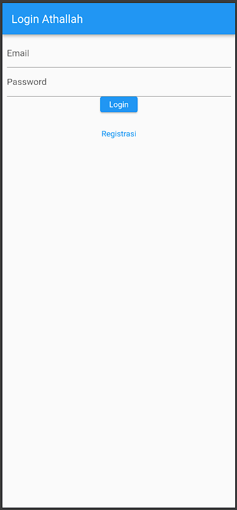
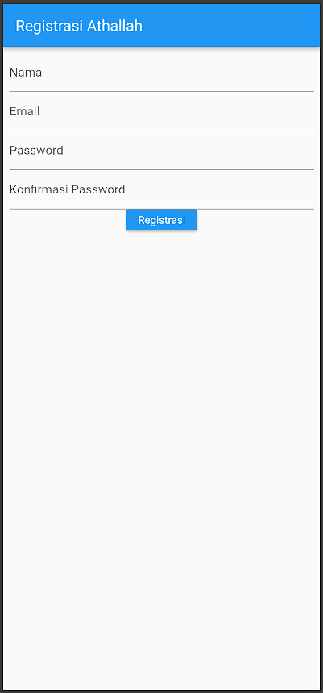
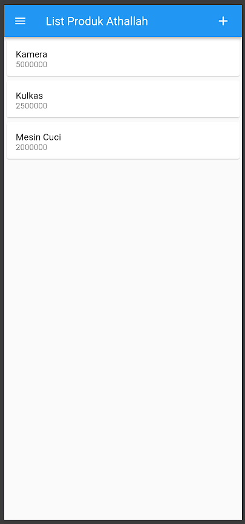
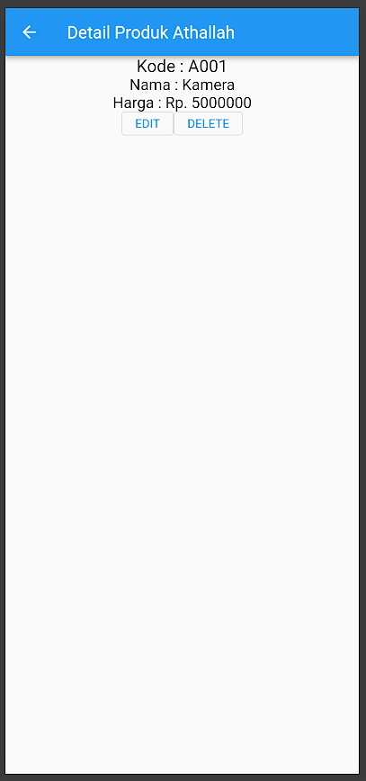
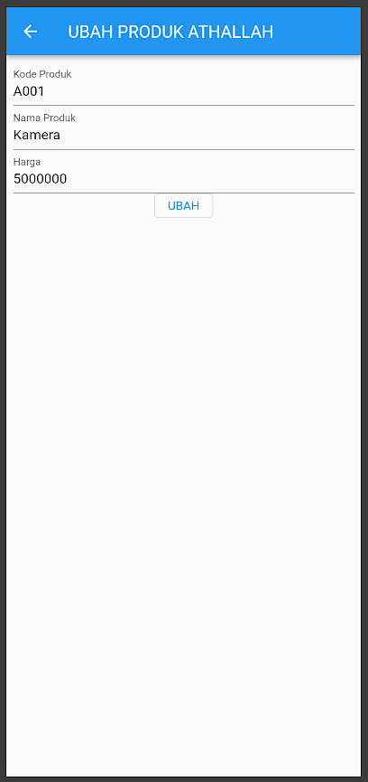

# Toko Kita - Aplikasi Flutter

Aplikasi manajemen produk sederhana yang dibuat menggunakan Flutter. Aplikasi ini memiliki fitur login, registrasi, dan CRUD (Create, Read, Update, Delete) produk.

**Nama: Athallah**

---

## Daftar Halaman

1. [Halaman Login](#1-halaman-login)
2. [Halaman Registrasi](#2-halaman-registrasi)
3. [Halaman List Produk](#3-halaman-list-produk)
4. [Halaman Detail Produk](#4-halaman-detail-produk)
5. [Halaman Form Produk (Tambah/Ubah)](#5-halaman-form-produk-tambahubah)

---

## 1. Halaman Login



### Penjelasan Kode

**File: `lib/ui/login_page.dart`**

Halaman login memiliki komponen-komponen berikut:

```dart
class LoginPage extends StatefulWidget {
  const LoginPage({Key? key}) : super(key: key);
  @override
  _LoginPageState createState() => _LoginPageState();
}
```

- **StatefulWidget**: Digunakan karena halaman ini memiliki state yang dapat berubah (input form).
- **_LoginPageState**: State class yang mengelola data dan UI halaman login.

#### Komponen Utama:

**1. Form Controller:**
```dart
final _formKey = GlobalKey<FormState>();
final _emailTextboxController = TextEditingController();
final _passwordTextboxController = TextEditingController();
```
- `_formKey`: Untuk validasi form
- `TextEditingController`: Mengelola input text dari user

**2. Email TextField:**
```dart
Widget _emailTextField() {
  return TextFormField(
    decoration: const InputDecoration(labelText: "Email"),
    keyboardType: TextInputType.emailAddress,
    controller: _emailTextboxController,
    validator: (value) {
      if (value!.isEmpty) {
        return 'Email harus diisi';
      }
      return null;
    },
  );
}
```
- Validasi memastikan email tidak kosong
- `keyboardType` disesuaikan untuk input email

**3. Password TextField:**
```dart
Widget _passwordTextField() {
  return TextFormField(
    decoration: const InputDecoration(labelText: "Password"),
    obscureText: true,
    validator: (value) {
      if (value!.isEmpty) {
        return "Password harus diisi";
      }
      return null;
    },
  );
}
```
- `obscureText: true` menyembunyikan karakter password

**4. Tombol Login:**
```dart
Widget _buttonLogin() {
  return ElevatedButton(
    child: const Text("Login"),
    onPressed: () {
      var validate = _formKey.currentState!.validate();
    }
  );
}
```

**5. Menu Registrasi:**
```dart
Widget _menuRegistrasi() {
  return Center(
    child: InkWell(
      child: const Text("Registrasi", style: TextStyle(color: Colors.blue)),
      onTap: () {
        Navigator.push(context,
          MaterialPageRoute(builder: (context) => const RegistrasiPage()));
      },
    ),
  );
}
```
- `InkWell` memberikan efek ripple saat diklik
- `Navigator.push` untuk navigasi ke halaman registrasi

---

## 2. Halaman Registrasi



### Penjelasan Kode

**File: `lib/ui/registrasi_page.dart`**

Halaman registrasi memiliki form yang lebih lengkap dibanding login.

#### Komponen Utama:

**1. Form Controllers:**
```dart
final _formKey = GlobalKey<FormState>();
final _namaTextboxController = TextEditingController();
final _emailTextboxController = TextEditingController();
final _passwordTextboxController = TextEditingController();
```

**2. Nama TextField:**
```dart
Widget _namaTextField() {
  return TextFormField(
    decoration: const InputDecoration(labelText: "Nama"),
    controller: _namaTextboxController,
    validator: (value) {
      if (value!.length < 3) {
        return "Nama harus diisi minimal 3 karakter";
      }
      return null;
    },
  );
}
```
- Validasi minimal 3 karakter

**3. Email TextField dengan Regex:**
```dart
Widget _emailTextField() {
  return TextFormField(
    decoration: const InputDecoration(labelText: "Email"),
    keyboardType: TextInputType.emailAddress,
    validator: (value) {
      if (value!.isEmpty) {
        return 'Email harus diisi';
      }
      Pattern pattern = r'^(([^<>()[\]\\.,;:\s@\"]+(\.[^<>()[\]\\.,;:\s@\"]+)*)|(\".+\"))@((\[[0-9]{1,3}\.[0-9]{1,3}\.[0-9]{1,3}\.[0-9]{1,3}\])|(([a-zA-Z\-0-9]+\.)+[a-zA-Z]{2,}))$';
      RegExp regex = RegExp(pattern.toString());
      if (!regex.hasMatch(value)) {
        return "Email tidak valid";
      }
      return null;
    },
  );
}
```
- Validasi format email menggunakan Regular Expression
- Memastikan email sesuai format standar

**4. Password TextField:**
```dart
Widget _passwordTextField() {
  return TextFormField(
    decoration: const InputDecoration(labelText: "Password"),
    obscureText: true,
    validator: (value) {
      if (value!.length < 6) {
        return "Password harus diisi minimal 6 karakter";
      }
      return null;
    },
  );
}
```
- Validasi minimal 6 karakter

**5. Konfirmasi Password:**
```dart
Widget _passwordKonfirmasiTextField() {
  return TextFormField(
    decoration: const InputDecoration(labelText: "Konfirmasi Password"),
    obscureText: true,
    validator: (value) {
      if (value != _passwordTextboxController.text) {
        return "Konfirmasi Password tidak sama";
      }
      return null;
    },
  );
}
```
- Memastikan password konfirmasi sama dengan password utama

---

## 3. Halaman List Produk



### Penjelasan Kode

**File: `lib/ui/produk_page.dart`**

Halaman ini menampilkan daftar produk dalam bentuk list.

#### Komponen Utama:

**1. AppBar dengan Action Button:**
```dart
appBar: AppBar(
  title: const Text('List Produk Athallah'),
  actions: [
    Padding(
      padding: const EdgeInsets.only(right: 20.0),
      child: GestureDetector(
        child: const Icon(Icons.add, size: 26.0),
        onTap: () async {
          Navigator.push(context,
            MaterialPageRoute(builder: (context) => ProdukForm()));
        },
      )
    )
  ],
),
```
- Icon `+` di kanan atas untuk menambah produk baru
- `GestureDetector` menangani tap event

**2. Drawer Menu:**
```dart
drawer: Drawer(
  child: ListView(
    children: [
      ListTile(
        title: const Text('Logout'),
        trailing: const Icon(Icons.logout),
        onTap: () async {},
      )
    ],
  ),
),
```
- Menu samping untuk logout

**3. ListView Produk:**
```dart
body: ListView(
  children: [
    ItemProduk(
      produk: Produk(
        id: '1',
        kodeProduk: 'A001',
        namaProduk: 'Kamera',
        hargaProduk: 5000000,
      ),
    ),
    // ... produk lainnya
  ],
),
```
- Menampilkan list produk menggunakan `ListView`
- Setiap item menggunakan widget `ItemProduk`

**4. Widget ItemProduk:**
```dart
class ItemProduk extends StatelessWidget {
  final Produk produk;
  const ItemProduk({Key? key, required this.produk}) : super(key: key);

  @override
  Widget build(BuildContext context) {
    return GestureDetector(
      onTap: () {
        Navigator.push(
          context,
          MaterialPageRoute(
            builder: (context) => ProdukDetail(produk: produk)
          )
        );
      },
      child: Card(
        child: ListTile(
          title: Text(produk.namaProduk!),
          subtitle: Text(produk.hargaProduk.toString()),
        ),
      ),
    );
  }
}
```
- `GestureDetector` menangani tap untuk navigasi ke detail
- `Card` memberikan efek elevation
- `ListTile` menampilkan nama dan harga produk

**5. Model Produk:**
```dart
class Produk {
  String? id;
  String? kodeProduk;
  String? namaProduk;
  var hargaProduk;
  
  Produk({this.id, this.kodeProduk, this.namaProduk, this.hargaProduk});
}
```

---

## 4. Halaman Detail Produk



### Penjelasan Kode

**File: `lib/ui/produk_detail.dart`**

Halaman ini menampilkan detail lengkap dari satu produk.

#### Komponen Utama:

**1. Menerima Data Produk:**
```dart
class ProdukDetail extends StatefulWidget {
  Produk? produk;
  ProdukDetail({Key? key, this.produk}) : super(key: key);
  
  @override
  _ProdukDetailState createState() => _ProdukDetailState();
}
```
- Parameter `produk` diterima dari halaman sebelumnya
- Menggunakan nullable (`?`) karena bisa null

**2. Menampilkan Detail:**
```dart
body: Center(
  child: Column(
    children: [
      Text(
        "Kode : ${widget.produk!.kodeProduk}",
        style: const TextStyle(fontSize: 20.0),
      ),
      Text(
        "Nama : ${widget.produk!.namaProduk}",
        style: const TextStyle(fontSize: 18.0),
      ),
      Text(
        "Harga : Rp. ${widget.produk!.hargaProduk.toString()}",
        style: const TextStyle(fontSize: 18.0),
      ),
      _tombolHapusEdit()
    ],
  ),
),
```
- Menggunakan `widget.produk` untuk mengakses data dari parent widget
- String interpolation (`${}`) untuk menampilkan data

**3. Tombol Edit dan Delete:**
```dart
Widget _tombolHapusEdit() {
  return Row(
    mainAxisSize: MainAxisSize.min,
    children: [
      OutlinedButton(
        child: const Text("EDIT"),
        onPressed: () {
          Navigator.push(
            context,
            MaterialPageRoute(
              builder: (context) => ProdukForm(produk: widget.produk!),
            ),
          );
        },
      ),
      OutlinedButton(
        child: const Text("DELETE"),
        onPressed: () => confirmHapus(),
      ),
    ],
  );
}
```
- Tombol EDIT navigasi ke form dengan data produk
- Tombol DELETE menampilkan dialog konfirmasi

**4. Dialog Konfirmasi Hapus:**
```dart
void confirmHapus() {
  AlertDialog alertDialog = AlertDialog(
    content: const Text("Yakin ingin menghapus data ini?"),
    actions: [
      OutlinedButton(
        child: const Text("Ya"),
        onPressed: () {
          // Logic hapus produk
        },
      ),
      OutlinedButton(
        child: const Text("Batal"),
        onPressed: () => Navigator.pop(context),
      )
    ],
  );
  showDialog(builder: (context) => alertDialog, context: context);
}
```
- `AlertDialog` menampilkan konfirmasi sebelum hapus
- `showDialog` menampilkan dialog di layar

---

## 5. Halaman Form Produk (Tambah/Ubah)



### Penjelasan Kode

**File: `lib/ui/produk_form.dart`**

Halaman ini digunakan untuk menambah produk baru atau mengubah produk yang sudah ada.

#### Komponen Utama:

**1. State Variables:**
```dart
class _ProdukFormState extends State<ProdukForm> {
  final _formKey = GlobalKey<FormState>();
  bool _isLoading = false;
  String judul = "TAMBAH PRODUK ATHALLAH";
  String tombolSubmit = "SIMPAN";
  
  final _kodeProdukTextboxController = TextEditingController();
  final _namaProdukTextboxController = TextEditingController();
  final _hargaProdukTextboxController = TextEditingController();
}
```
- `judul` dan `tombolSubmit` berubah sesuai mode (tambah/ubah)
- 3 controller untuk masing-masing input field

**2. InitState dan isUpdate:**
```dart
@override
void initState() {
  super.initState();
  isUpdate();
}

isUpdate() {
  if (widget.produk != null) {
    setState(() {
      judul = "UBAH PRODUK ATHALLAH";
      tombolSubmit = "UBAH";
      _kodeProdukTextboxController.text = widget.produk!.kodeProduk!;
      _namaProdukTextboxController.text = widget.produk!.namaProduk!;
      _hargaProdukTextboxController.text = widget.produk!.hargaProduk.toString();
    });
  } else {
    judul = "TAMBAH PRODUK ATHALLAH";
    tombolSubmit = "SIMPAN";
  }
}
```
- `initState()` dipanggil saat widget pertama kali dibuat
- `isUpdate()` mengecek apakah mode edit atau tambah
- Jika ada data produk, isi form dengan data tersebut

**3. Form Layout:**
```dart
@override
Widget build(BuildContext context) {
  return Scaffold(
    appBar: AppBar(title: Text(judul)),
    body: SingleChildScrollView(
      child: Padding(
        padding: const EdgeInsets.all(8.0),
        child: Form(
          key: _formKey,
          child: Column(
            children: [
              _kodeProdukTextField(),
              _namaProdukTextField(),
              _hargaProdukTextField(),
              _buttonSubmit()
            ],
          ),
        ),
      ),
    ),
  );
}
```
- `SingleChildScrollView` memungkinkan scroll jika konten melebihi layar
- `Form` widget untuk validasi

**4. Input Fields:**

**Kode Produk:**
```dart
Widget _kodeProdukTextField() {
  return TextFormField(
    decoration: const InputDecoration(labelText: "Kode Produk"),
    keyboardType: TextInputType.text,
    controller: _kodeProdukTextboxController,
    validator: (value) {
      if (value!.isEmpty) {
        return "Kode Produk harus diisi";
      }
      return null;
    },
  );
}
```

**Nama Produk:**
```dart
Widget _namaProdukTextField() {
  return TextFormField(
    decoration: const InputDecoration(labelText: "Nama Produk"),
    keyboardType: TextInputType.text,
    controller: _namaProdukTextboxController,
    validator: (value) {
      if (value!.isEmpty) {
        return "Nama Produk harus diisi";
      }
      return null;
    },
  );
}
```

**Harga Produk:**
```dart
Widget _hargaProdukTextField() {
  return TextFormField(
    decoration: const InputDecoration(labelText: "Harga"),
    keyboardType: TextInputType.number,
    controller: _hargaProdukTextboxController,
    validator: (value) {
      if (value!.isEmpty) {
        return "Harga harus diisi";
      }
      return null;
    },
  );
}
```
- `keyboardType: TextInputType.number` menampilkan keyboard numerik

**5. Tombol Submit:**
```dart
Widget _buttonSubmit() {
  return OutlinedButton(
    child: Text(tombolSubmit),
    onPressed: () {
      var validate = _formKey.currentState!.validate();
    }
  );
}
```
- Text tombol dinamis (SIMPAN/UBAH)
- Validasi form sebelum submit

---

## Struktur Folder

```
lib/
├── main.dart                 # Entry point aplikasi
├── model/
│   ├── login.dart           # Model untuk login
│   ├── produk.dart          # Model untuk produk
│   └── registrasi.dart      # Model untuk registrasi
└── ui/
    ├── login_page.dart      # Halaman login
    ├── registrasi_page.dart # Halaman registrasi
    ├── produk_page.dart     # Halaman list produk
    ├── produk_detail.dart   # Halaman detail produk
    └── produk_form.dart     # Halaman form tambah/ubah produk
```

---

## Fitur Utama

1. **Form Validation**: Semua form memiliki validasi input
2. **Navigation**: Navigasi antar halaman menggunakan Navigator
3. **State Management**: Menggunakan StatefulWidget untuk state management
4. **Responsive Layout**: Menggunakan SingleChildScrollView untuk layout yang responsive
5. **Custom Styling**: AppBar dengan nama custom (Athallah)

---

## Teknologi yang Digunakan

- **Flutter**: Framework untuk pengembangan aplikasi
- **Dart**: Bahasa pemrograman
- **Material Design**: Design system dari Google

---

## Cara Menjalankan

1. Clone repository ini
2. Jalankan `flutter pub get` untuk install dependencies
3. Jalankan `flutter run -d chrome` untuk menjalankan di browser
4. Atau `flutter run` untuk menjalankan di device/emulator

---

**Dibuat oleh: Athallah**
